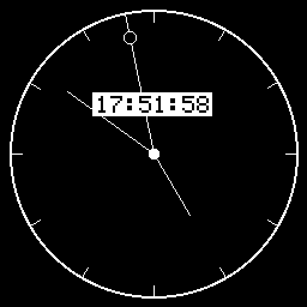
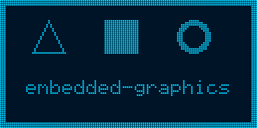
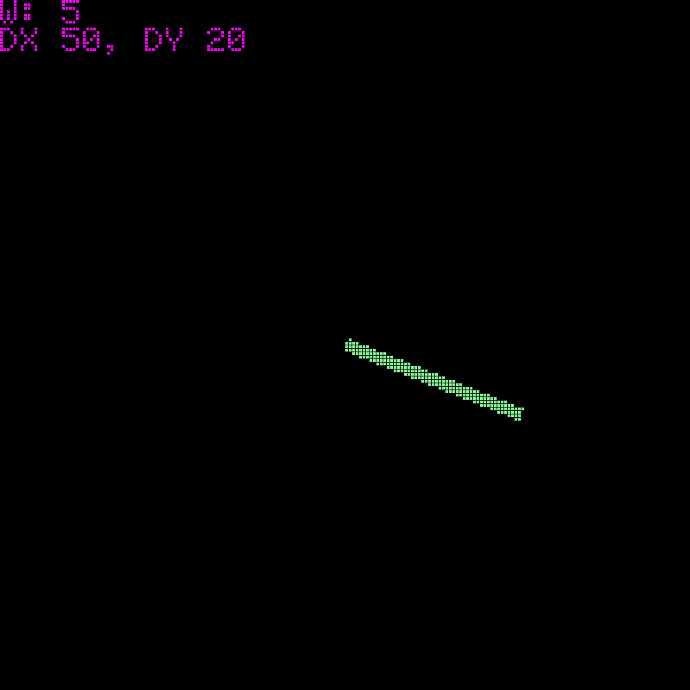
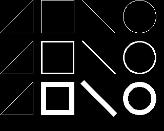
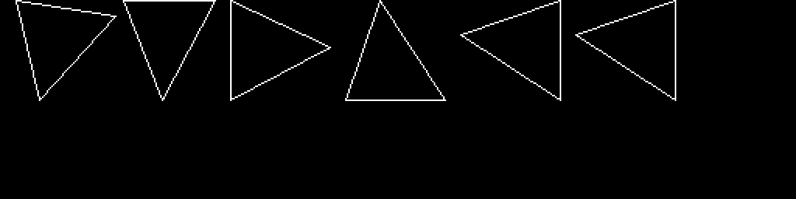
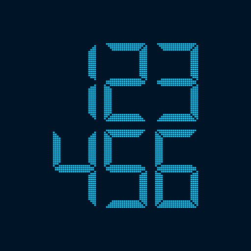
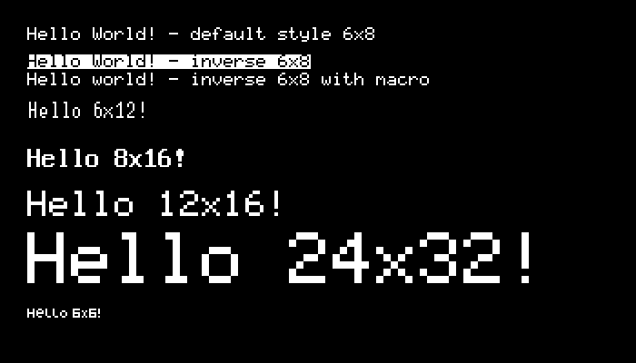
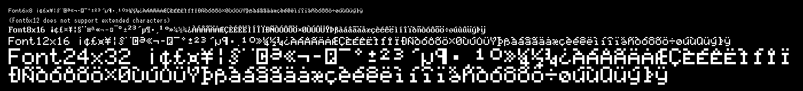
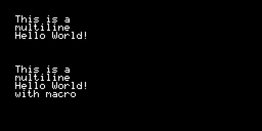
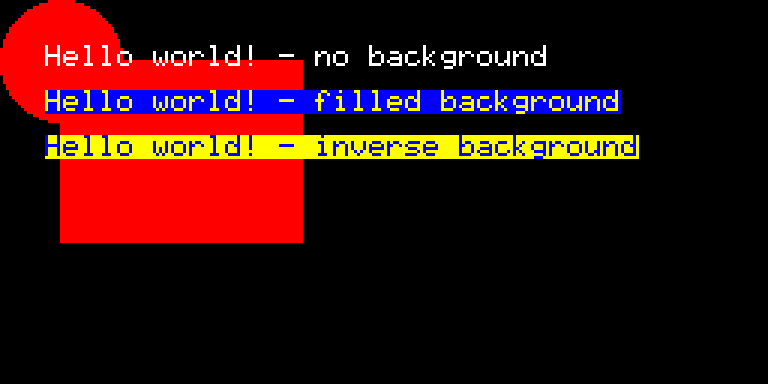

# Embedded graphics examples and demos for version `0.6`

## [analog-clock](examples/analog-clock.rs)

## [chaining](examples/chaining.rs)

## [hello-world](examples/hello-world.rs)

## [image-bmp](examples/image-bmp.rs)

## [image-tga](examples/image-tga.rs)

## [input-handling](examples/input-handling.rs)

## [line-thickness](examples/line-thickness.rs)

## [primitives-fill-macros](examples/primitives-fill-macros.rs)

## [primitives-fill](examples/primitives-fill.rs)

## [primitives-stroke](examples/primitives-stroke.rs)

## [primitives-triangles](examples/primitives-triangles.rs)

## [text-custom-font](examples/text-custom-font.rs)

## [text-fonts](examples/text-fonts.rs)

## [text-fonts-signs](examples/text-fonts-signs.rs)

## [text-multiline](examples/text-multiline.rs)

## [text-transparent](examples/text-transparent.rs)

