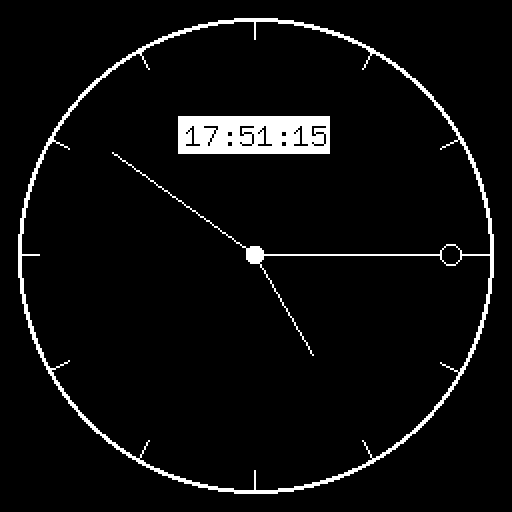
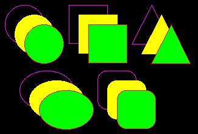

# Embedded graphics examples and demos for version `next`

## [demo-analog-clock](examples/demo-analog-clock.rs)

## [demo-pacman](examples/demo-pacman.rs)

## [demo-progress](examples/demo-progress.rs)

## [hello-world](examples/hello-world.rs)

## [image-bmp](examples/image-bmp.rs)

## [image-sub-image](examples/image-sub-image.rs)

## [image-tga](examples/image-tga.rs)

## [primitives-fill](examples/primitives-fill.rs)

## [primitives-polyline](examples/primitives-polyline.rs)

## [primitives-stroke-alignment](examples/primitives-stroke-alignment.rs)

## [primitives-stroke](examples/primitives-stroke.rs)

## [primitives-triangles](examples/primitives-triangles.rs)

## [text-alignment](examples/text-alignment.rs)

## [text-custom-font](examples/text-custom-font.rs)

## [text-extended-characters](examples/text-extended-characters.rs)

## [text-fonts](examples/text-fonts.rs)

## [text-multiline](examples/text-multiline.rs)

## [text-styles](examples/text-styles.rs)

## [text-transparent](examples/text-transparent.rs)

